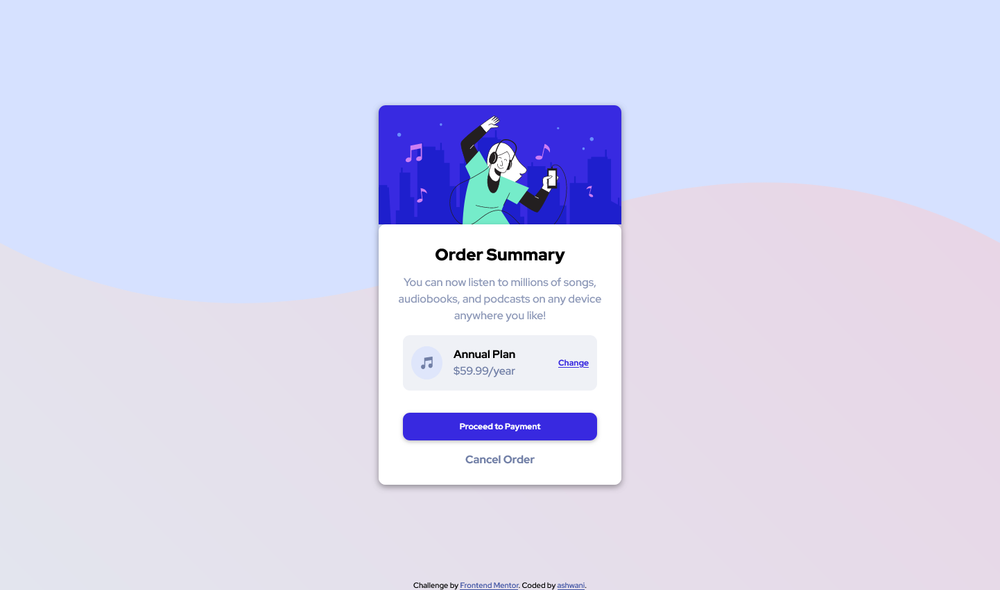

# Frontend Mentor - Order summary card solution

This is a solution to the [Order summary card challenge on Frontend Mentor](https://www.frontendmentor.io/challenges/order-summary-component-QlPmajDUj). Frontend Mentor challenges help you improve your coding skills by building realistic projects. 

## Table of contents

- [Overview](#overview)
  - [The challenge](#the-challenge)
  - [Screenshot](#screenshot)
  - [Links](#links)
- [Author](#author)
- [Acknowledgments](#acknowledgments)

**Note: Delete this note and update the table of contents based on what sections you keep.**

## Overview

### The challenge

Users should be able to:

- See hover states for interactive elements

### Screenshot

### Links

- Solution URL: [solution URL here](https://your-solution-url.com)
- Live Site URL: [live site URL here](https://your-live-site-url.com)

## My process

### Built with

- Semantic HTML5 markup
- CSS custom properties
- Flexbox
- CSS Grid
- Mobile-first workflow

## Author

## Author

- Frontend Mentor - [@ashwanipydev](https://www.frontendmentor.io/profile/ashwanipydev)
- Twitter - [@CodeWithMeaning](https://twitter.com/CodeWithMeaning)

## Acknowledgments

Special thanks to Frontend Mentor (frontendmentor.com) for providing engaging coding challenges, Kevin Powell's YouTube channel for insightful web development tutorials, Hitesh Choudhary's CodeWithHarry for valuable coding guidance, and Love Babbar for sharing programming knowledge. Their contributions have greatly enriched the learning experience.

**Have fun building!** 🚀